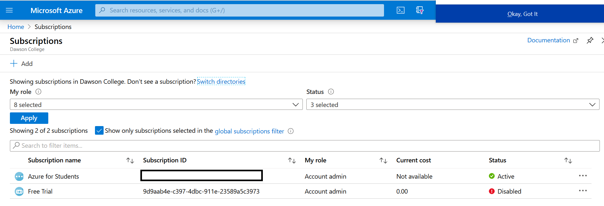
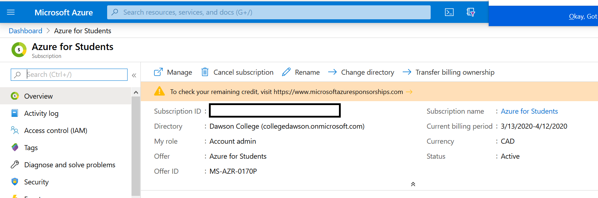
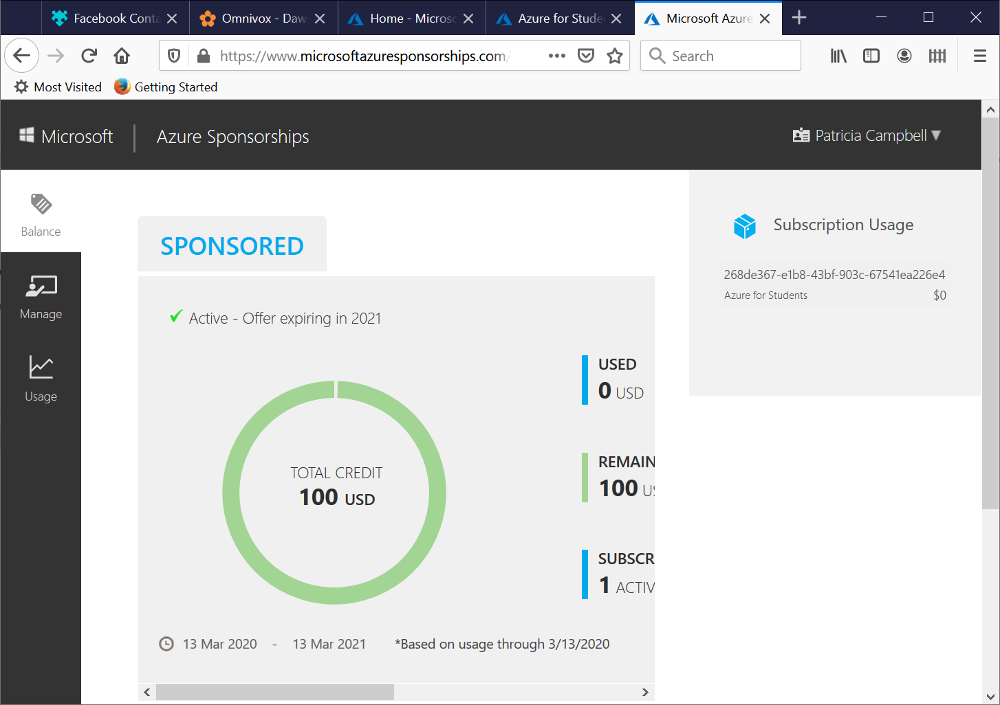

# Set up on Azure

1. logon to the portal using your dawson id/password  https://portal.azure.com will redirect you to logon.
2. claim the education credit
3. apply the education credit
4. Once applied you will see a subscription to *Azure for Students*
	
5. if you click on it you will see the management console for it, take note of the subscription id you will use it with the azure cli.
	
6. if you [check your credit](https://www.microsoftazuresponsorships.com/) you will see
	

