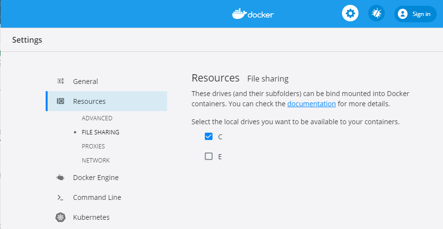
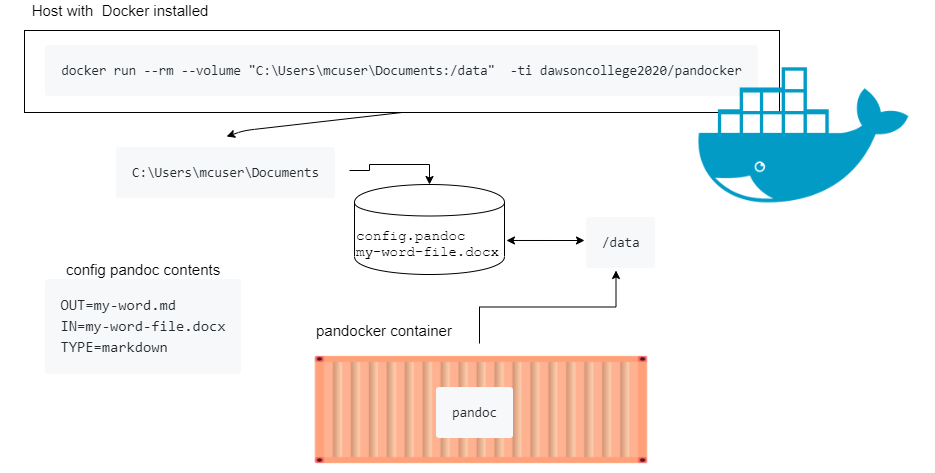

# Using pandocker on Windows

[Pandoc](pandoc.org) is a command line utility that you can use to covert various document formats into others.  For example word _.docx_ files to markdown _.md_

This container will allow you to run [pandoc](pandoc.org) whenever you need it, without installing it on your windows box.  It puts a simple bash script as a front end to pandoc.  You give it have an input file name (pandoc will determine the type), output file name and the output file conversion type.  Or you can give it, full, more complex pandoc options see the [example](#example-config-file)

__Note__ The container works by "sharing" the volume (directory) you give it from your windows computer, to a mount point of `/data` on the container see the run statement.  That directory needs to contain your *source file* to be converted and _optionally_ a *config.pandoc file* to instruct the container what to convert. 

## TL;DR

1. install [docker](https://docs.docker.com/get-docker/)  
2. share drives with docker see [one time prep](#one-time-prep)
2. put your file to be converted ex my.docx and a config file config.pandoc into the same directory ex c:\your\directory (other files will be ignored.)  
3. populate  config.pandoc:
   ```
   IN=my.docx
   TYPE=markdown
   OUT=my.md
   ```
3. open a command line window
4. run `docker run --rm --volume "C:\your\directory:/data"  -ti dawsoncollege2020/pandocker` 
5. you now have my.md in the directory, it is the converted my.docx

## Detailed instructions
There are 2 ways of using this container:

1. headless using a config file (`config.pandoc` or `config.pandoc.txt`) the bash script reads this config & performs the requested actions
2. interactively, clunky, type in your info to a bash script


The container image is public and in the organization [dawsoncollege2020](https://hub.docker.com/u/dawsoncollege2020) on docker hub.

### One time prep	
This will have to be done once only, afterward, or if you've already set up docker, go to the [run](#run) section.
1.  Install [Docker Desktop on Windows](https://docs.docker.com/docker-for-windows/install/)
4.  Drives are not automatically shared with Docker Desktop so you must change the Docker Desktop settings before you start the container. Click on the docker icon, select settings, a window will launch , select resources then file sharing, make sure the drive that you want to use is selected.  

### Run
There are two ways to use this image, the first is without interacting with it (headless), it reads the config file and does it's thing.  The second is interactive, where you have to type in the information. 

Instructions for 
* headless [run with config file](#headless-how-to-using-config.pandoc), see also an [example headless runtime](#headless-run-time-example-output)
* interactive [type in the information](#interactively-(-config.pandoc-does-not-exist-)) see also an [example interactive runtime](#interactive-runtime-example-output)
#### headless how to using config.pandoc 

Determine where the file to be converted and the config.pandoc file are on your windows system the example below assumes they are in your Documents directory, example `C:\Users\mcuser\Documents>`  

The easiest way to use this is using a config file
1.  All files will be in the same directory 
2.  Create a file in the directory,  `config.pandoc` or `config.pandoc.txt`, example contents:
     ```
     OUT=win-my-word.md		# destination file name
     IN=win-my-word.docx      	# file to be converted
     TYPE=markdown		# conversion type
     ```
     note: uses bash syntax so, case sensitive, left justify, no spaces around the ` = ` and if your file name has spaces, encase in double quotes `IN="my file.docx"`
1. Open a Command Prompt Window 
2. Run the following in a Command Window `docker run --rm --volume "C:\Users\mcuser\Documents:/data"  -ti dawsoncollege2020/pandocker`  (can also  be run in [PowerShell](#powershell))  

* Did you get a weird `No such file or directory` when it's clearly there?  Just retry, see [know bug](#no-such-file)
* Instead of the full path `C:\Users\mcuser`, you can use
     * `%USERPROFILE%` environment variable in cmd, 
     * `$env:USERPROFILE` environment variable in PowerShell
* Note the first time you run this it will take longer as it has to download the image (~300MB,) subsequent runs will use the local copy. 

__That\'s it__, if there are no typos you will see `win-my-word.md` in the same Documents directory._


##### headless run time example output
Note this is running in Windows Powershell
```
PS C:\Users\mcuser\Documents> docker run --rm --volume "C:\Users\mcuser\Documents:/data"  -ti dawsoncollege2020/pandocker
pandoc.sh about to convert source win-my-word.docx to markdown destination win-my-word.md
pandoc.sh see converted file win-my-word.md in the current working directory
PS C:\Users\mcuser\Documents> ls win-my*


    Directory: C:\Users\mcuser\Documents


Mode                LastWriteTime         Length Name
----                -------------         ------ ----
-a----        11/4/2019   2:26 PM          14945 win-my-word.docx
-a----        4/20/2020   6:15 PM          14526 win-my-word.md
 
```

#### interactively ( config.pandoc  does not exist )
Your file must be in the shared volume, if a config.pandoc exists it will be used, so delete if you don't want it.
1. Open a Command Prompt 
2. Run the following in a Command Window `docker run --rm --volume "C:\Users\mcuser\Documents:/data"  -ti dawsoncollege2020/pandocker`
3. respond to the text prompts
##### interactive runtime example output
Note this is running in Command Prompt
```
C:\Users\mcuser\>docker run --rm --volume "C:\Users\mcuser\Documents:/data"  -ti dawsoncollege2020/pandocker
pandoc.sh file to convert must be in current working directory

source file to convert file name
win-my-word.docx
destination file name
out.md
convert to type ex markdown
markdown
pandoc.sh see converted file out.md in the current working directory
C:\Users\mcuser\Documents>dir win-my* out*
 Volume in drive C is Windows x64 Bit
 Volume Serial Number is D096-AD0C

 Directory of C:\Users\mcuser\Documents

11/04/2019  03:26 PM            14,945 win-my-word.docx
04/20/2020  06:15 PM            14,526 out.md
               2 File(s)         29,471 bytes
               0 Dir(s)  823,968,378,880 bytes free
```
## example config file 
It must be named config.pandoc or config.pandoc.txt
[config.pandoc](full.example.config.pandoc)
### option 1 complete command line options see [pandoc.org](pandoc.org)
```
# this config file must be  in the same directory as the files to be converted
# anything begining with a hashtag is a comment
# Option 1 give the complete command line options, if this exists, the rest will be ignored
CMDLINE='-s moodlequiz.docx -o moodlequiz.text  -t mediawiki'
```
### option 2  individual options
```
# this config file must be  in the same directory as the files to be converted
# anything begining with a hashtag is a comment
# Option 2 individual options
IN="420-241-DW-01-02-Campbell_2019.docx"
OUT=test.txt
#TYPE=mediawiki
TYPE=markdown
```
## Powershell 
The syntax below is only different because in command env vars are used so `%ENVVAR%` and in PowerShell they are use so `$env:ENVVAR`
1. Open a PowerShell
2. Run the following  `docker run --rm --volume "$env:USERPROFILE\Documents:/data"  -ti dawsoncollege2020/pandocker` 
## Errors 
Some errors you may encounter
### file not found
There is an intermittent open  bug Docker for Windows where files are not found, there is no fix as of 2020-04-20 so just run again if you get `No such file or directory` when it's clearly there.   

Open Bug https://github.com/docker/for-win/issues/5959 

   ```
   PS C:\Users\mcuser\Documents> docker run --rm --volume "$env:USERPROFILE\Documents:/data"  -ti dawsoncollege2020/pandocker
   /usr/bin/pandoc.sh: source: line 44: can't open 'config.pandoc.txt': No such file or directory
   PS C:\Users\mcuser\Documents> ls .\config.pandoc.txt


       Directory: C:\Users\mcuser\Documents


   Mode                LastWriteTime         Length Name
   ----                -------------         ------ ----
   -a----        4/20/2020   2:08 PM            212 config.pandoc.txt
   ```
### drive not shared 
The following is what you will  see if the drive is not shared:

via cmd window
```
C:\Users\mcuser>echo %USERPROFILE%
C:\Users\mcuser
C:\Users\mcuser>docker run --rm --volume "%USERPROFILE%\Documents:/data"  -ti dawsoncollege2020/pandocker
docker: Error response from daemon: status code not OK but 500: {"Message":"Unhandled exception: Drive has not been shared"}.
See 'docker run --help'.
```
via PowerShell
```
PS C:\Users\mcuser\Documents> echo $env:USERPROFILE
C:\Users\mcuser
PS C:\Users\mcuser\Documents> docker run --rm --volume "$env:USERPROFILE\Documents:/data"  -ti dawsoncollege2020/pandocker
C:\Program Files\Docker\Docker\resources\bin\docker.exe: Error response from daemon: status code not OK but 500: {"Message":"Unhandled exception: Drive has not been shared"}.
See 'C:\Program Files\Docker\Docker\resources\bin\docker.exe run --help'.
PS C:\Users\mcuser\Documents>
```
### not logged on or name typo
via cmd window
```
C:\Users\mcuser>docker run --rm --volume "%USERPROFILE%\Documents:/data"  -ti dawsoncollege2020/pandokcer
Unable to find image 'dawsoncollege2020/pandokcer:latest' locally
docker: Error response from daemon: pull access denied for dawsoncollege2020/pandokcer, repository does not exist or may require 'docker login': denied: requested access to the resource is denied.
See 'docker run --help'.
```
