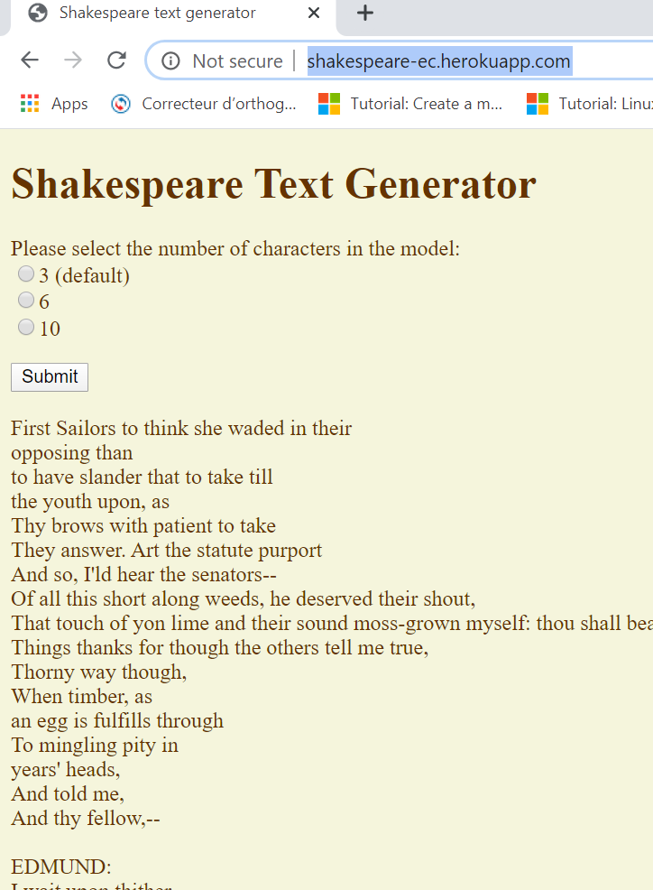

# Deploy an image to heroku
Note: abandoning using mixed docker & heroku commands to deploy
now just heroku

Note: to there is a bug with apache on heroku, heroku adds config files so you have to 
apply a fix `heroku labs:enable --app YOUR-APP runtime-new-layer-extract`

Note: EXPOSE does not work in heroku, PORT envir var is set so another work around,  `sed -i "s/Listen 80/Listen ${PORT:-80}/g" /etc/apache2/ports.conf`  Because of this we have a different Dockerfile so that we can do this ^ before launching apache

## refs
* https://devcenter.heroku.com/articles/heroku-cli-commands 

## pull the image from docker hub so the image is local
Note: you can be developing & working with a local image, in that case no need to pull
```
[tricia@korra shakespeare-ec]$ docker pull tricia/shakespeare-ec
```
## display the images 
```
[tricia@korra shakespeare-ec]$ docker images
REPOSITORY                           IMAGE ID            CREATED             SIZE
tricia/shakespeare-ec                latest              8524faf9b7b8        7 days ago          602MB
hello-world                          latest              fce289e99eb9        14 months ago       1.84kB
```
## tag the image for the heroku registry 
```
[tricia@korra shakespeare-ec]$ docker tag tricia/shakespeare-ec registry.heroku.com/shakespeare-ec  
```
## display the images 
```
[tricia@korra shakespeare-ec]$ docker images
REPOSITORY                           TAG                 IMAGE ID            CREATED             SIZE
registry.heroku.com/shakespeare-ec   latest              8524faf9b7b8        7 days ago          602MB
tricia/shakespeare-ec                latest              8524faf9b7b8        7 days ago          602MB
hello-world                          latest              fce289e99eb9        14 months ago       1.84kB
```
## create the app on heroku
* `heroku create --app shakespeare-ec`

* `heroku apps`
    ```
    tricia@acerubuntu1804:~/ecq/docker-ecq2020/shakespeare-jm$ heroku apps
    === pcampbell.edu@gmail.com Apps
    blooming-anchorage-54363
    frozen-cliffs-58488
    shakespeare-ec
    ```
* `heroku apps:info --app shakespeare-ec`
```
tricia@acerubuntu1804:~/ecq/docker-ecq2020/shakespeare-jm$ heroku apps:info --app shakespeare-ec
=== shakespeare-ec
Auto Cert Mgmt: false
Dynos:          web: 1
Git URL:        https://git.heroku.com/shakespeare-ec.git
Owner:          pcampbell.edu@gmail.com
Region:         us
Repo Size:      0 B
Slug Size:      0 B
Stack:          container
Web URL:        https://shakespeare-ec.herokuapp.com/
```
# deploy to heroku: short verison 
one time only, create the app on heroku
1.  create  `heroku create --app shakespeare-ec` 

one time only, maybe? , bug on heroku 
1.  fix `heroku labs:enable --app shakespeare-ec runtime-new-layer-extract` 

maybe need repeating, until it works 

1.  push `heroku container:push web --app shakespeare-ec`
2.  release `heroku container:release web  --app shakespeare-ec` and `heroku releases --app shakespeare-ec`
3.  monitor `heroku logs --tail --app shakespeare-ec`
4.  test browser + http://shakespeare-ec.herokuapp.com

## 1 push
```
[tricia@korra shakespeare-ec]$  heroku container:push web --app shakespeare-ec
=== Building web (/home/tricia/docker-ecq2020/shakespeare-ec/Dockerfile)
Sending build context to Docker daemon  3.721MB
Step 1/11 : FROM php:7.2-apache
 ---> ba07a75a195b
Step 2/11 : MAINTAINER P Campbell pcampbell.edu@gmail.com
 ---> Using cache
 ---> 324716aad9d6
Step 3/11 : ENV DEBIAN_FRONTEND noninteractive
 ---> Using cache
 ---> fb2ad4a027fa
Step 4/11 : RUN apt-get -y update &&  apt-get -y install git redis-server && apt-get clean
 ---> Using cache
 ---> 8cf2b30a3220
Step 5/11 : WORKDIR /var/www/html/
 ---> Using cache
 ---> 87ed07857505
Step 6/11 : COPY app.tgz .
 ---> Using cache
 ---> 9f74beeef618
Step 7/11 : RUN tar -xzf app.tgz ; rm app.tgz ; mv app/* . ; rm -rf app .git
 ---> Using cache
 ---> e44e4ad8502e
Step 8/11 : RUN  curl -sS https://getcomposer.org/installer|php; ./composer.phar require predis/predis
 ---> Using cache
 ---> 0907a43c65cc
Step 9/11 : EXPOSE 80
 ---> Using cache
 ---> 4af990698103
Step 10/11 : RUN redis-server /etc/redis/redis.conf ; php loader.php
 ---> Using cache
 ---> 4092147576c7
Step 11/11 : CMD  redis-server /etc/redis/redis.conf ;  apachectl -D  FOREGROUND
         ---> Running in a62f5e30c344
Removing intermediate container a62f5e30c344
 ---> c4aba6e99768
Successfully built c4aba6e99768
Successfully tagged registry.heroku.com/shakespeare-ec/web:latest
=== Pushing web (/home/tricia/docker-ecq2020/shakespeare-ec/Dockerfile)
The push refers to repository [registry.heroku.com/shakespeare-ec/web]
7ea2ede06357: Layer already exists
07d5ed573660: Layer already exists
6c7402745cd9: Layer already exists
048cf045cd9f: Layer already exists
cc740e7caf6e: Layer already exists
6565bce2d5e5: Layer already exists
2159d2f64d7e: Layer already exists
7c111aa3fc84: Layer already exists
1bc9b7122630: Layer already exists
bc4aa4d1d971: Layer already exists
8b81b9cd95de: Layer already exists
85dc2281e45a: Layer already exists
0fc284fc9cf5: Layer already exists
732057c800a3: Layer already exists
4cc11613548d: Layer already exists
df6c050501b6: Layer already exists
b4bfb20b5f05: Layer already exists
2e8cc9f5313f: Layer already exists
f2cb0ecef392: Layer already exists
latest: digest: sha256:75733a415c6df09ec897a4e56d1ddaf632dba9d5e556355b59f21d7aeeb52863 size: 4300
Your image has been successfully pushed. You can now release it with the 'container:release' command.
```
## 2 release
```
 heroku container:release web  --app shakespeare-ec
Releasing images web to shakespeare-ec... done
[tricia@korra shakespeare-ec]$ heroku releases --app shakespeare-ec
=== shakespeare-ec Releases - Current: v10
v10  Deployed web (65bd6554b932)  pcampbell.edu@gmail.com  2020/02/28 15:20:20 -0500 (~ 14s ago)
v9   Deployed web (4935e333e6ff)  pcampbell.edu@gmail.com  2020/02/28 15:18:09 -0500 (~ 2m ago)
v8   Deployed web (c71fa0e3688d)  pcampbell.edu@gmail.com  2020/02/28 15:16:29 -0500 (~ 4m ago)
v7   Deployed web (5964971b8c67)  pcampbell.edu@gmail.com  2020/02/28 15:12:33 -0500 (~ 8m ago)
v6   Deployed web (6ac35b537cef)  pcampbell.edu@gmail.com  2020/02/28 15:09:41 -0500 (~ 10m ago)
v5   Deployed web (2ef8bad7ccfa)  pcampbell.edu@gmail.com  2020/02/28 15:07:17 -0500 (~ 13m ago)
v4   Deployed web (65ea7cb43b31)  pcampbell.edu@gmail.com  2020/02/28 14:54:00 -0500 (~ 26m ago)
v3   Deployed web (8c930156468d)  pcampbell.edu@gmail.com  2020/02/28 13:53:58 -0500 (~ 1h ago)
v2   Enable Logplex               pcampbell.edu@gmail.com  2020/02/27 22:00:44 -0500 (~ 17h ago)
v1   Initial release              pcampbell.edu@gmail.com  2020/02/27 22:00:43 -0500 (~ 17h ago)
```
## 3 monitor
### failing
```
[tricia@korra docker-ecq2020]$ heroku logs --tail --app shakespeare-ec
2020-02-28T19:54:33.634678+00:00 app[web.1]: no listening sockets available, shutting down
2020-02-28T19:54:33.634678+00:00 app[web.1]: AH00015: Unable to open logs
2020-02-28T19:54:33.647666+00:00 app[web.1]: Action '-D FOREGROUND' failed.
2020-02-28T19:54:33.647667+00:00 app[web.1]: The Apache error log may have more information.
2020-02-28T19:54:33.724537+00:00 heroku[web.1]: Process exited with status 1
2020-02-28T19:54:34.918635+00:00 heroku[router]: at=error code=H10 desc="App crashed" method=GET path="/" host=shakespeare-ec.herokuapp.com request_id=6deda7fd-2b60-4abb-b66b-41186f15e877 fwd="69.165.158.16" dyno= connect= service= status=503 bytes= protocol=http
2020-02-28T19:54:36.353353+00:00 heroku[router]: at=error code=H10 desc="App crashed" method=GET path="/favicon.ico" host=shakespeare-ec.herokuapp.com request_id=baefb38b-af82-402e-9391-495e286abb1e 
2020-02-28T20:07:17.297929+00:00 heroku[web.1]: State changed from crashed to starting
2020-02-28T20:07:17.083059+00:00 app[api]: Release v5 created by user pcampbell.edu@gmail.com
2020-02-28T20:07:17.083059+00:00 app[api]: Deployed web (2ef8bad7ccfa) by user pcampbell.edu@gmail.com
2020-02-28T20:07:34.719845+00:00 heroku[web.1]: Starting process with command `/bin/sh -c redis-server\ /etc/redis/redis.conf\ \;\ bash\ herokufix.sh`
2020-02-28T20:07:37.024508+00:00 heroku[web.1]: State changed from starting to crashed
2020-02-28T20:07:37.028911+00:00 heroku[web.1]: State changed from crashed to starting
2020-02-28T20:07:36.941387+00:00 app[web.1]: herokufix.sh: line 8: /usr/local/bin/docker-entrypoint.sh: No such file or directory
2020-02-28T20:07:37.005028+00:00 heroku[web.1]: Process exited with status 127
```
### working 
```
2020-02-28T20:33:09.729571+00:00 heroku[router]: at=info method=GET path="/favicon.ico" host=shakespeare-ec.herokuapp.com request_id=07d70926-8075-4a49-847f-d83423711992 fwd="198.168.48.222" dyno=web.1 connect=0ms service=4ms status=404 bytes=470 protocol=http
2020-02-28T20:33:09.730055+00:00 app[web.1]: 0e87bf0d-ba6d-484d-8e60-87b673d5e839.prvt.dyno.rt.heroku.com:80 10.97.254.14 - - [28/Feb/2020:20:33:09 +0000] "GET /favicon.ico HTTP/1.1" 404 470 "-" "Mozilla/5.0 (Windows NT 10.0; Win64; x64; rv:73.0) Gecko/20100101 Firefox/73.0"
2020-02-28T20:33:33.932984+00:00 heroku[router]: at=info method=POST path="/" host=shakespeare-ec.herokuapp.com request_id=10a1cc09-d6e7-4145-8402-7adfb698916c fwd="198.168.48.222" dyno=web.1 connect=0ms service=1133ms status=200 bytes=1158 protocol=http
2020-02-28T20:33:33.932235+00:00 app[web.1]: 0e87bf0d-ba6d-484d-8e60-87b673d5e839.prvt.dyno.rt.heroku.com:80 10.35.221.122 - - [28/Feb/2020:20:33:32 +0000] "POST / HTTP/1.1" 200 1158 "http://shakespeare-ec.herokuapp.com/" "Mozilla/5.0 (Windows NT 10.0; Win64; x64; rv:73.0) Gecko/20100101 Firefox/73.0"
```
 
# deploy to heroku: long verison with trouble shooting

## login to heroku
```
[tricia@korra shakespeare-ec]$ heroku login -i
heroku: Enter your login credentials
Email: pcampbell.edu@gmail.com
Password: *********
Logged in as pcampbell.edu@gmail.com
```
## create app on heroku
```
heroku create shakespeare-ec
```
##  push does a rebuild ??
```
[tricia@korra shakespeare-ec]$ heroku container:push web --app shakespeare-ec^C
(reverse-i-search)`': ^C
[tricia@korra shakespeare-ec]$ heroku container:push web --app shakespeare-ec
=== Building web (/home/tricia/docker-ecq2020/shakespeare-ec/Dockerfile)
Sending build context to Docker daemon  3.718MB
Step 1/11 : FROM php:7.2-apache
 ---> ba07a75a195b
Step 2/11 : MAINTAINER P Campbell pcampbell.edu@gmail.com
 ---> Using cache
 ---> 324716aad9d6
Step 3/11 : ENV DEBIAN_FRONTEND noninteractive
 ---> Using cache
 ---> fb2ad4a027fa
Step 4/11 : RUN apt-get -y update &&  apt-get -y install git redis-server && apt-get clean
 ---> Using cache
 ---> 8cf2b30a3220
Step 5/11 : WORKDIR /var/www/html/
 ---> Using cache
 ---> 87ed07857505
Step 6/11 : COPY app.tgz .
 ---> 9f74beeef618
Step 7/11 : RUN tar -xzf app.tgz ; rm app.tgz ; mv app/* . ; rm -rf app .git
 ---> Running in 22760e658668
Removing intermediate container 22760e658668
 ---> e44e4ad8502e
Step 8/11 : RUN  curl -sS https://getcomposer.org/installer|php; ./composer.phar require predis/predis
 ---> Running in d170633b4baa
All settings correct for using Composer
Downloading...

Composer (version 1.9.3) successfully installed to: /var/www/html/composer.phar
Use it: php composer.phar

Using version ^1.1 for predis/predis
./composer.json has been created
Loading composer repositories with package information
Updating dependencies (including require-dev)
Package operations: 1 install, 0 updates, 0 removals
    Failed to download predis/predis from dist: The zip extension and unzip command are both missing, skipping.
The php.ini used by your command-line PHP is: /usr/local/etc/php/conf.d/docker-php-ext-sodium.ini
    Now trying to download from source
  - Installing predis/predis (v1.1.1): Cloning f0210e3888 from cache
predis/predis suggests installing ext-phpiredis (Allows faster serialization and deserialization of the Redis protocol)
Writing lock file
Generating autoload files
Removing intermediate container d170633b4baa
 ---> 0907a43c65cc
Step 9/11 : EXPOSE 80
 ---> Running in e0b0b06b6ce1
Removing intermediate container e0b0b06b6ce1
 ---> 4af990698103
Step 10/11 : RUN redis-server /etc/redis/redis.conf ; php loader.php
 ---> Running in 15f60be01d62

Database Flushed

Loading Database For: 3 characters
Start Time: 06:47:48 PM
End Time: 06:47:51 PM

Loading Database For: 6 characters
Start Time: 06:47:51 PM
End Time: 06:48:28 PM

Loading Database For: 10 characters
Start Time: 06:48:28 PM
End Time: 06:51:13 PM
Removing intermediate container 15f60be01d62
 ---> 4092147576c7
Step 11/11 : CMD  redis-server /etc/redis/redis.conf ; apachectl -D  FOREGROUND
 ---> Running in dd94bed54693
Removing intermediate container dd94bed54693
 ---> 8c930156468d
Successfully built 8c930156468d
Successfully tagged registry.heroku.com/shakespeare-ec/web:latest
=== Pushing web (/home/tricia/docker-ecq2020/shakespeare-ec/Dockerfile)
The push refers to repository [registry.heroku.com/shakespeare-ec/web]
7ea2ede06357: Pushed
07d5ed573660: Pushed
6c7402745cd9: Pushed
048cf045cd9f: Pushed
cc740e7caf6e: Pushed
6565bce2d5e5: Pushed
2159d2f64d7e: Pushed
7c111aa3fc84: Layer already exists
1bc9b7122630: Pushed
bc4aa4d1d971: Pushed
8b81b9cd95de: Pushed
85dc2281e45a: Pushed
0fc284fc9cf5: Layer already exists
732057c800a3: Layer already exists
4cc11613548d: Pushed
df6c050501b6: Pushed
b4bfb20b5f05: Pushed
2e8cc9f5313f: Pushed
f2cb0ecef392: Pushed
latest: digest: sha256:5f233a9c7967d3d829562cabf2f4ac0924cebda6c2f2408462127e349db2b418 size: 4300
Your image has been successfully pushed. You can now release it with the 'container:release' command.
```
## check releases (before release)
```
[tricia@korra shakespeare-ec]$ heroku releases --app shakespeare-ec
=== shakespeare-ec Releases - Current: v2
v2  Enable Logplex   pcampbell.edu@gmail.com  2020/02/27 22:00:44 -0500 (~ 15h ago)
v1  Initial release  pcampbell.edu@gmail.com  2020/02/27 22:00:43 -0500 (~ 15h ago)
```

## release for web access
```
[tricia@korra shakespeare-ec]$ heroku container:release  --app shakespeare-ec
 ▸    Error: Requires one or more process types
 ▸
 ▸    Usage:
 ▸    heroku container:release web                       # Releases the
 ▸    previously pushed web process type
 ▸    heroku container:release web worker                # Releases the
 ▸    previously pushed web and worker process types
[tricia@korra shakespeare-ec]$ heroku container:release  --app shakespeare-ec web
Releasing images web to shakespeare-ec... done
```
## check releases (after release)
```
[tricia@korra shakespeare-ec]$ heroku releases  --app shakespeare-ec
=== shakespeare-ec Releases - Current: v3
v3  Deployed web (8c930156468d)  pcampbell.edu@gmail.com  2020/02/28 13:53:58 -0500 (~ 1m ago)
v2  Enable Logplex               pcampbell.edu@gmail.com  2020/02/27 22:00:44 -0500 (~ 15h ago)
v1  Initial release              pcampbell.edu@gmail.com  2020/02/27 22:00:43 -0500 (~ 15h ago)
```
## app crashed

## look at the log files
see https://devcenter.heroku.com/articles/logging#view-logs

used `heroku logs --tail --app shakespeare-ec`
```
2020-02-28T18:53:58.605751+00:00 app[api]: Scaled to web@1:Free by user pcampbell.edu@gmail.com
2020-02-28T18:53:58.576757+00:00 app[api]: Release v3 created by user pcampbell.edu@gmail.com
2020-02-28T18:54:13.796274+00:00 heroku[web.1]: Starting process with command `/bin/sh -c redis-server\ /etc/redis/redis.conf\ \;\ apachectl\ -D\ \ FOREGROUND`
2020-02-28T18:54:17.140606+00:00 heroku[web.1]: State changed from starting to crashed
2020-02-28T18:54:17.144682+00:00 heroku[web.1]: State changed from crashed to starting
2020-02-28T18:54:17.115064+00:00 heroku[web.1]: Process exited with status 1
2020-02-28T18:54:17.007372+00:00 app[web.1]: AH00534: apache2: Configuration error: More than one MPM loaded.
2020-02-28T18:54:17.024734+00:00 app[web.1]: Action '-D FOREGROUND' failed.
2020-02-28T18:54:17.024735+00:00 app[web.1]: The Apache error log may have more information.
2020-02-28T18:54:25.960064+00:00 heroku[web.1]: Starting process with command `/bin/sh -c redis-server\ /etc/redis/redis.conf\ \;\ apachectl\ -D\ \ FOREGROUND`
2020-02-28T18:54:27.814845+00:00 heroku[web.1]: State changed from starting to crashed
2020-02-28T18:54:27.743483+00:00 app[web.1]: AH00534: apache2: Configuration error: More than one MPM loaded.
2020-02-28T18:54:27.755537+00:00 app[web.1]: Action '-D FOREGROUND' failed.
2020-02-28T18:54:27.755537+00:00 app[web.1]: The Apache error log may have more information.
2020-02-28T18:54:27.797901+00:00 heroku[web.1]: Process exited with status 1
2020-02-28T18:56:28.363389+00:00 heroku[router]: at=error code=H10 desc="App crashed" method=GET path="/" host=shakespeare-ec.herokuapp.com request_id=53b2d1e0-9f1f-4981-abf5-8f5303843b36 fwd="69.165.158.16" dyno= connect= service= status=503 bytes= protocol=http
2020-02-28T18:56:30.272729+00:00 heroku[router]: at=error code=H10 desc="App crashed" method=GET path="/favicon.ico" host=shakespeare-ec.herokuapp.com request_id=84c38de1-400c-4b49-b200-2b0383d6c3af fwd="69.165.158.16" dyno= connect= service= status=503 bytes= protocol=http
```
## fix ?? it's a heroku bug
see https://github.com/docker-library/wordpress/issues/293
```
heroku labs:enable --app=YOUR-APP runtime-new-layer-extract
```
rebuild & re deploy, get the same error sa in the ^ issues/293
```
2020-02-28T19:54:17.800800+00:00 app[web.1]: (13)Permission denied: AH00072: make_sock: could not bind to address [::]:80
2020-02-28T19:54:17.800977+00:00 app[web.1]: (13)Permission denied: AH00072: make_sock: could not bind to address 0.0.0.0:80
2020-02-28T19:54:17.801045+00:00 app[web.1]: no listening sockets available, shutting down
2020-02-28T19:54:17.801065+00:00 app[web.1]: AH00015: Unable to open logs
2020-02-28T19:54:17.815713+00:00 app[web.1]: Action '-D FOREGROUND' failed.
```
## need to use $PORT not EXPOSE as per
https://devcenter.heroku.com/articles/container-registry-and-runtime#dockerfile-commands-and-runtime

add COPY to Dockerfile & run before loading apache2
```
[tricia@korra shakespeare-ec]$ cat herokufix.sh
#!/usr/bin/env bash

# https://github.com/docker-library/wordpress/issues/293
# EXPOSE does not work for heroku
# $PORT used instead

sed -i "s/Listen 80/Listen ${PORT:-80}/g" /etc/apache2/ports.conf
```
#  finally it works!!!


