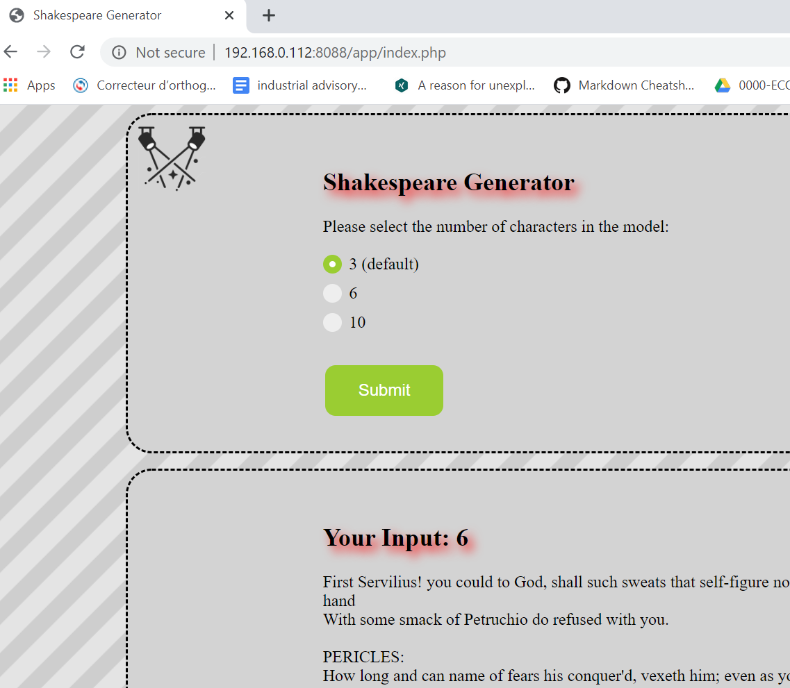

#  shakespeare-jm
This is a proof of concept containerized PHP app.   The code was written by J Boisvert & M Mishin as an
assignment given by J. Nilakantan @ Dawson College for the Computer Science PHP course in the 3rd year PHP course Fall 2019.  

My thanks to everyone for lending me their work.

It uses a PHP & apache image + redis data store  
## TL;DR
### To run this app
1. install docker https://docs.docker.com/install/ 
    * on *nix you will need to add your user to the docker group to run as a regular user `sudo usermod -aG docker youruserid`
2. run `docker run -d -p 8888:80 tricia/shakespeare-jm` 
    * 80 is the container port and 8888 is the host that is running docker, port forwarding from
 container 80 to host 8888 is done by docker, choose a high port if you don't want 8888
    * \-d detaches the container, if you omit you will see the startup and the apache output
3. load a browser to access the app `localhost:8888` or `ip.address.of.host:8888`
### To build a container  (general info)
1.  install docker https://docs.docker.com/install/
2.  create a Dockerfile that uses an appropriate base image & installs the software you need.  See here for the [Dockerfile](Dockerfile.md) with explanations that was used to create this app.
    * Dockerfile reference https://docs.docker.com/engine/reference/builder/
3.  build the image, run `docker build -t **containerimagename** .` (tweak Dockerfile until it works!)
4.  run the container, run `docker run containerimagename`       to test it.
**__Note__** If you are newly learning docker I __strongly__ suggest you use the command line interface as it may be used anywhere: windoze, *nix, and cloud shells.  No need to learn new interfaces every time.

## docker registry image repo
It is available as a public image in my repo 
https://hub.docker.com/repository/docker/tricia/shakespeare-jm 

### running an image
If you don't want to clone this repo to use my scripts you can run this image (provided docker is installed) use this command change hostport to whatever you want (high is eaiser wrt firewalls) docker will do port forwarding for you:
```
docker run -p hostport:80 tricia/shakespeare-jm
```
In the following example the command was `docker run -d -p 8088:80 tricia/shakespeare-jm`
See [here](RUNTIME-NIX.md) for using docker on a Fedora 31 box,  download from the hub and run the first time, non-detached so you see the startup and apache output.


### running on cloud
You cannot pull from docker hub without docker AFAICT, each cloud provider has it's own registry if you want to use any of those you will have to set up an account & use the Dockerfile & app to create your own image in the cloud's own registry.  I will add this information elsewhere.
## Scripts (install docker before using)
### build.run.sh
This script will build the image from the Dockerfile in this repo, then run it.
### tohub.sh
This script will push the image to docker hub, you will need to logon `docker logon` to do this.

## Creating a container image (Dockerfile)
Multi container apps use docker compose yaml and Dockerfiles, this app has a single container so everything to define the image is in the Dockerfile.  You need the Dockerfile to create the image, so that you can add it to a repository & reuse the container.  Once it is in the repo you no longer need the Dockerfile, unless you are going to make changes to the app or its supporting software or config. 

See here for the [Dockerfile](Dockerfile.md) with explanations that was used to create this app.

### docker commands
see  [common docker commands](DOCKERCMDS.md) 

Short list of examples: 
if you want to see what is going on with the image use `docker ps` or `docker ps -a`
```
[tricia@acerfed31 ~]$ docker ps
CONTAINER ID        IMAGE                   COMMAND                  CREATED             STATUS              PORTS                  NAMES
9ad94ed4cb4b        tricia/shakespeare-jm   "docker-php-entrypoi…"   29 minutes ago      Up 29 minutes       0.0.0.0:8088->80/tcp   relaxed_shtern
[tricia@acerfed31 ~]$
```
In the above the container NAME is relaxed_shtern (you can name your containers when you run them if you do not docker names them.  
If you want to shell into your container you use the name `docker exec -ti containername sh` 
Note, as you see below, when you shell into a container you are root, \#,  and the commands available will be limited, for example this image does not have netstat / ss / net-tools installed.  They could be installed but I would do that just for testing.
```
[tricia@acerfed31 ~]$ docker exec -ti relaxed_shtern sh
# ps aux
USER         PID %CPU %MEM    VSZ   RSS TTY      STAT START   TIME COMMAND
root           1  0.0  0.0   2384   764 ?        Ss   Feb17   0:00 /bin/sh -c redis-server /etc/redis/redis.conf ; php load_model.php 3 6 10 ; a
root           7  5.1  6.1 401984 352360 ?       Ssl  Feb17   1:42 redis-server 127.0.0.1:6379
root          16  0.0  0.0   2384   764 ?        S    Feb17   0:00 /bin/sh /usr/sbin/apachectl -D FOREGROUND
root          18  0.0  0.4  82900 25036 ?        S    Feb17   0:00 /usr/sbin/apache2 -D FOREGROUND
www-data      19  0.0  0.2  83224 12208 ?        S    Feb17   0:00 /usr/sbin/apache2 -D FOREGROUND
www-data      20  0.0  0.2  83224 12900 ?        S    Feb17   0:00 /usr/sbin/apache2 -D FOREGROUND
www-data      21  0.0  0.1  82964  8272 ?        S    Feb17   0:00 /usr/sbin/apache2 -D FOREGROUND
# df -h
Filesystem                               Size  Used Avail Use% Mounted on
overlay                                   69G  9.2G   56G  15% /
tmpfs                                     64M     0   64M   0% /dev
tmpfs                                    2.8G     0  2.8G   0% /sys/fs/cgroup
shm                                       64M     0   64M   0% /dev/shm
/dev/mapper/fedora_localhost--live-root   69G  9.2G   56G  15% /etc/hosts
tmpfs                                    2.8G     0  2.8G   0% /proc/asound
tmpfs                                    2.8G     0  2.8G   0% /proc/acpi
tmpfs                                    2.8G     0  2.8G   0% /proc/scsi
tmpfs                                    2.8G     0  2.8G   0% /sys/firmware
# ls -l /var/www/html/app
total 1940
-rw-r--r--. 1 1000 1000     139 Feb 14 15:21 README.md
-rw-r--r--. 1 1000 1000      59 Feb 17 22:35 composer.json
-rw-r--r--. 1 1000 1000    2336 Feb 14 15:21 composer.lock
-rwxr-xr-x. 1 root root 1936645 Feb 17 22:35 composer.phar
drwxr-xr-x. 2 1000 1000    4096 Feb 14 15:21 data
drwxr-xr-x. 2 1000 1000    4096 Feb 14 15:21 images
-rw-r--r--. 1 1000 1000    5432 Feb 17 21:32 index.php
-rw-r--r--. 1 1000 1000    3097 Feb 17 21:12 load_model.php
drwxr-xr-x. 2 1000 1000    4096 Feb 14 15:21 model
drwxr-xr-x. 2 1000 1000    4096 Feb 14 15:21 styles
-rw-rw-r--. 1 1000 1000       0 Feb 14 21:27 today.2020-02-14
drwxr-xr-x. 4 root root    4096 Feb 17 22:35 vendor
# exit
```
To stop the container (The image is still there, you can start it again, it will not take as long as it does not have to download) run `docker stop containername`
```
[tricia@acerfed31 ~]$ docker ps
CONTAINER ID        IMAGE                   COMMAND                  CREATED             STATUS              PORTS                  NAMES
9ad94ed4cb4b        tricia/shakespeare-jm   "docker-php-entrypoi…"   39 minutes ago      Up 38 minutes       0.0.0.0:8088->80/tcp   relaxed_shtern
[tricia@acerfed31 ~]$ docker stop relaxed_shtern
relaxed_shtern
[tricia@acerfed31 ~]$ docker ps
CONTAINER ID        IMAGE               COMMAND             CREATED             STATUS              PORTS               NAMES
[tricia@acerfed31 ~]$
```
To see all images that are local, downloaded or created through Dockerfiles &/or compose yaml files use `docker images`.
I can run any of the below by name, they are downloaded so they run quickly. 
```
Feb 17 17:52:08 acerfed31.campbell.ca dockerd[995]: time="2020-02-17T17:52:08.956405982-05:00" level=warning msg="60223a65560950767a8aa0d974
Feb 17 17:57:06 acerfed31.campbell.ca dockerd[995]: time="2020-02-17T17:57:06.729411781-05:00" level=info msg="ignoring event" module=libcon
[tricia@acerfed31 ~]$ docker images
REPOSITORY              TAG                 IMAGE ID            CREATED             SIZE
tricia/shakespeare-jm   latest              becc74c4f566        2 hours ago         479MB
docker                  latest              6512892b5768        3 days ago          224MB
tricia/flaskpoc         latest              77d6b8a97457        4 days ago          119MB
whalesay                latest              0a7b27bff74b        2 weeks ago         276MB
tricia/whalesay1        latest              0a7b27bff74b        2 weeks ago         276MB
fortune.only            latest              714458c13641        2 weeks ago         7.64MB
bulletinboard           1.0                 4129fed1b3c6        2 weeks ago         681MB
alpine                  3.7                 6d1ef012b567        11 months ago       4.21MB
hello-world             latest              fce289e99eb9        13 months ago       1.84kB
node                    6.11.5              852391892b9f        2 years ago         662MB
docker/whalesay         latest              6b362a9f73eb        4 years ago         247MB
[tricia@acerfed31 ~]$
```
run another container:
```
[tricia@acerfed31 ~]$ docker run tricia/whalesay1
 _____________________________________
/ Everything will be just tickety-boo \
\ today.                              /
 -------------------------------------
    \
     \
      \
                    ##        .
              ## ## ##       ==
           ## ## ## ##      ===
       /""""""""""""""""___/ ===
  ~~~ {~~ ~~~~ ~~~ ~~~~ ~~ ~ /  ===- ~~~
       \______ o          __/
        \    \        __/
          \____\______/
 ___   _                      _            _
|_ _| | | _____   _____    __| | ___   ___| | _____ _ __
 | |  | |/ _ \ \ / / _ \  / _` |/ _ \ / __| |/ / _ \ '__|
 | |  | | (_) \ V /  __/ | (_| | (_) | (__|   <  __/ |
|___| |_|\___/ \_/ \___|  \__,_|\___/ \___|_|\_\___|_|

[tricia@acerfed31 ~]$
```
