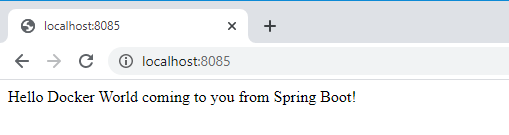
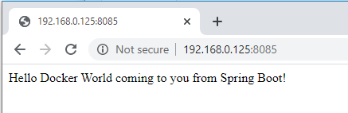
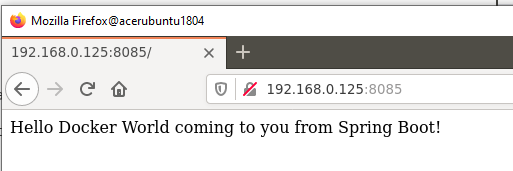
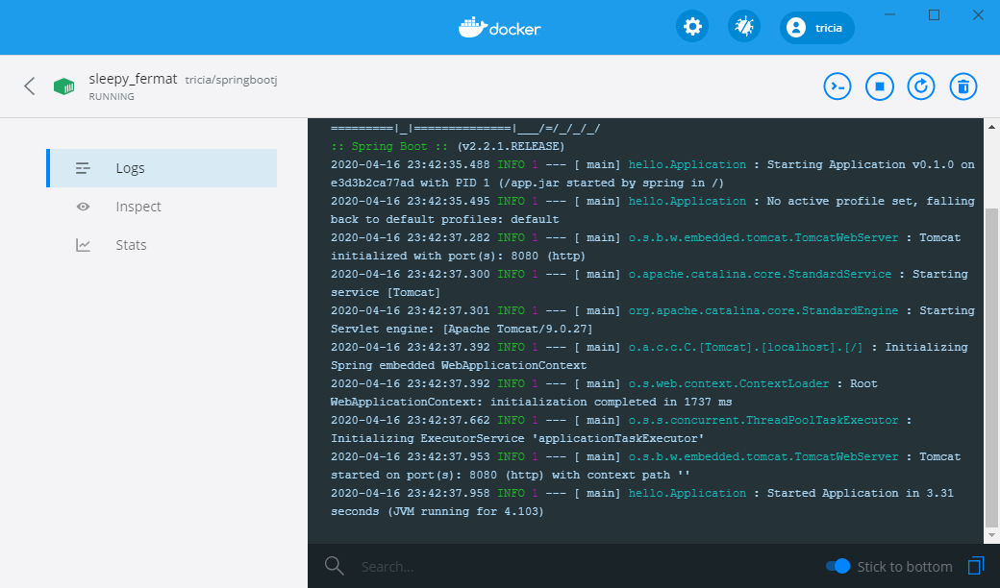
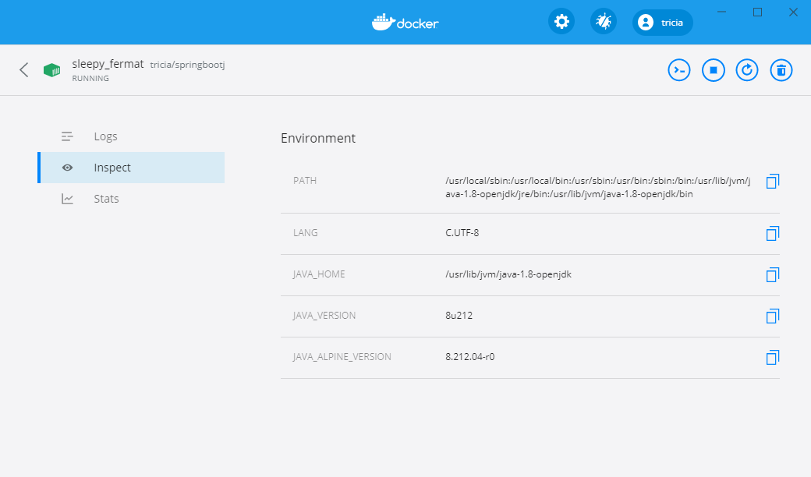
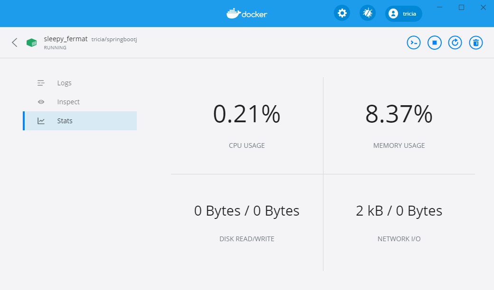

# run the image from docker hub on Windows 10
__WARNING__ a quirk of windows the -p for port forwarding must be 1st, or, frustration will ensue, port will not be forwarded.
```
C:\Users\pcampbell>docker run -p 8085:8080 -t tricia/springbootj 
Unable to find image 'tricia/springbootj:latest' locally
latest: Pulling from tricia/springbootj
e7c96db7181b: Pull complete 
f910a506b6cb: Pull complete
c2274a1a0e27: Pull complete 
83eab4d68636: Pull complete 
956625960763: Pull complete
Digest: sha256:ca1a349a1481cf319000a85d6827aef67ce41158db787f47011275342a5736de
Status: Downloaded newer image for tricia/springbootj:latest

  .   ____          _            __ _ _
 /\\ / ___'_ __ _ _(_)_ __  __ _ \ \ \ \
( ( )\___ | '_ | '_| | '_ \/ _` | \ \ \ \
 \\/  ___)| |_)| | | | | || (_| |  ) ) ) )
  '  |____| .__|_| |_|_| |_\__, | / / / /
 =========|_|==============|___/=/_/_/_/
 :: Spring Boot ::        (v2.2.1.RELEASE)

2020-04-16 23:42:35.488  INFO 1 --- [           main] hello.Application                        : Starting Application v0.1.0 on e3d3b2ca77ad with PID 1 (/app.jar started by spring in /)
2020-04-16 23:42:35.495  INFO 1 --- [           main] hello.Application                        : No active profile set, falling back to default profiles: default
2020-04-16 23:42:37.282  INFO 1 --- [           main] o.s.b.w.embedded.tomcat.TomcatWebServer  : Tomcat initialized with port(s): 8080 (http)
2020-04-16 23:42:37.300  INFO 1 --- [           main] o.apache.catalina.core.StandardService   : Starting service [Tomcat]
2020-04-16 23:42:37.301  INFO 1 --- [           main] org.apache.catalina.core.StandardEngine  : Starting Servlet engine: [Apache Tomcat/9.0.27]
2020-04-16 23:42:37.392  INFO 1 --- [           main] o.a.c.c.C.[Tomcat].[localhost].[/]       : Initializing Spring embedded WebApplicationContext
2020-04-16 23:42:37.392  INFO 1 --- [           main] o.s.web.context.ContextLoader            : Root WebApplicationContext: initialization completed in 1737 ms
2020-04-16 23:42:37.662  INFO 1 --- [           main] o.s.s.concurrent.ThreadPoolTaskExecutor  : Initializing ExecutorService 'applicationTaskExecutor'
2020-04-16 23:42:37.953  INFO 1 --- [           main] o.s.b.w.embedded.tomcat.TomcatWebServer  : Tomcat started on port(s): 8080 (http) with context path ''
2020-04-16 23:42:37.958  INFO 1 --- [           main] hello.Application                        : Started Application in 3.31 seconds (JVM running for 4.103)
```
## accessing the app
### localhost:8085

### ipaddress:8085

### from another computer ipaddress:8085

## docker desktop snapshots
### running app

### inspect app

### stats for app

