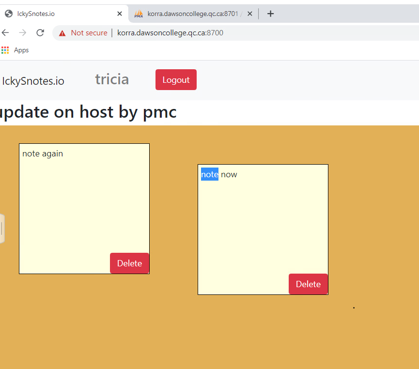
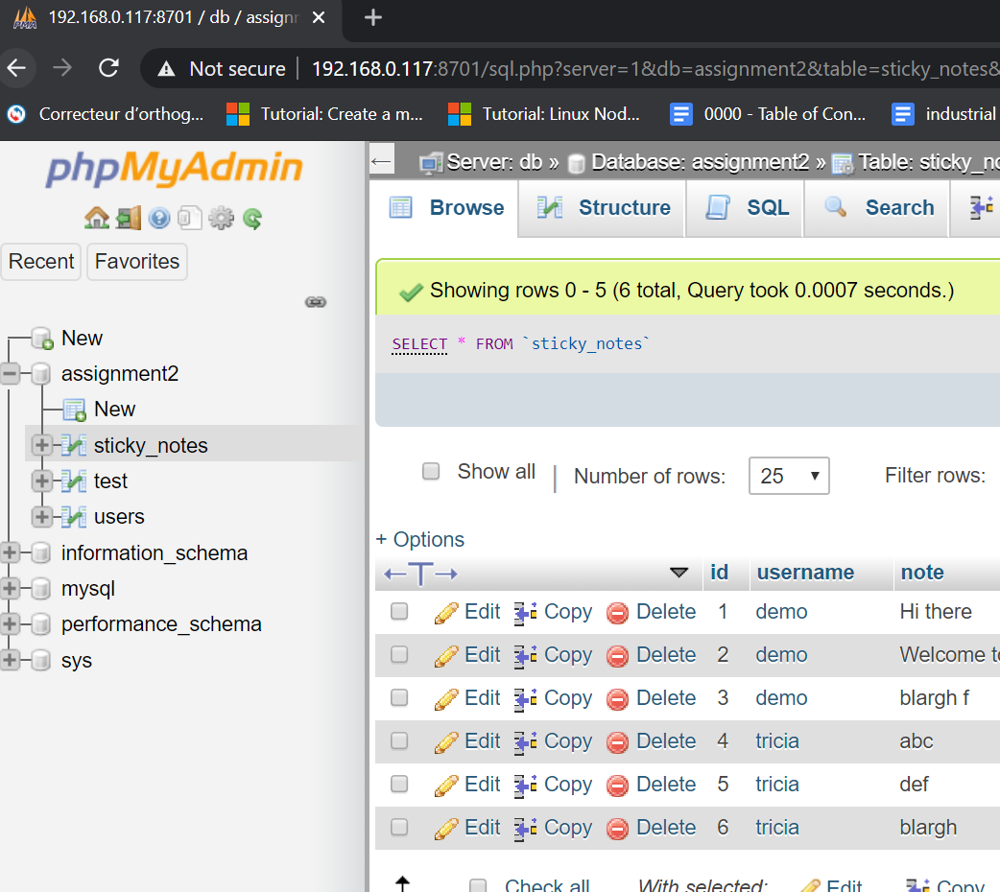

#  stickynotes-jb
This is a proof of concept containerized PHP app.   The code was written by J Boisvert & ?  as an
assignment given by J. Nilakantan @ Dawson College for the Computer Science PHP course in the 3rd year PHP course Fall 2019.  

My thanks to everyone for lending me their work.

It uses three containers 
* php  apache + php + app  (has a Dockerfile)
* db  mysql (standard image, config through yaml file)
* phpmyadmin (standard image, config through yaml file)

This is the first app using multiple containers & docker compose 
* https://hub.docker.com/_/mysql/ 
* https://docs.docker.com/compose/compose-file/
* https://docs.docker.com/compose/gettingstarted/

__Note:__  This is a multi container setup for development, there are several volumes mapped to the localhost to aide testing & dev.  Some would be changed for a production deployment, see below for overview of mapping & port forwarding, [yaml](docker-compose.yaml) file for specifics 
__Note:__  The information in this repo is expanded upon for this [google slide presentation](https://docs.google.com/presentation/d/1mmvSdb4RyTNta__thGgcuFWSesQE6boD5BXvmA77W74/edit?usp=sharing)

# Runtime __topology__ for this group of containers:

## TL;DR
### To run this app
1. install docker https://docs.docker.com/install/ 
    * on *nix you will need to add your user to the docker group to run as a regular user `sudo usermod -aG docker youruserid`
2. install docker-compose https://docs.docker.com/compose/install/
2. clone this repo
3. make sure this is your current working directory, run `docker-compose build` 
4. run `docker-compose  up  -d ` 
    * \-d detaches the container, if you omit you will see the startup and the logs from all containers
    * __note__ you do not need the -p unless you want to override the port forwarding in the docker-compose.yaml 
    * when you use docker, the run command does the port forwarding
    * with multi container apps you need to use docker-compose the config for everyting is in the yaml file see [docker compose yaml](docker-compose.yaml.md) for info,  change [docker-compose.yaml](docker-compose.yaml)  if you want to use a different port

3. load a browser to access the app `localhost:8700` or `ip.address.of.host:8700`
4. load a browser to access phpmyadmin for the app db `localhost:8701` or `ip.address.of.host:8701`

**__Note__** If you are newly learning docker I __strongly__ suggest you use the command line interface as it may be used anywhere: windoze, *nix, and cloud shells.  No need to learn new interfaces every time.

## docker registry image repo
The app image is available as a public image in my repo, but it cannot be run standalone see __running this app__ 

https://hub.docker.com/repository/docker/tricia/stickynotes-jb_php

### running this app 
This image cannot be run standalone, it needs a database container.  You must clone this repo and use `docker-compose up -d ` access via a browser http://localhost:8700, access phpmyadmin via http://localhost:8701    All configuration is in the yaml file [docker-compose.yaml](docker-compose.yaml)  for the syntax / explanations see [docker-compose.yaml with explanations ](docker-compose.yaml.md)
### the app on korra Centos 7.x

### the phpmyadmin on my local box

### running on cloud
todo insert info for running on cloud
## Creating a container image (docker compose & Dockerfiles)
Multi container apps use docker compose yaml and Dockerfiles

See here for the [docker compose yaml](docker-compose.yaml.md) that pulls it all together, with explanations that was used to create this app.

See here for the [php & apache Dockerfile](php/Dockerfile.md) with explanations that was used to create one of the containers for this app.

See here for the [runtime use of these commands](DOCKERCOMPOSERUN.md) & [troubleshooting db errors](DOCKERCOMPOSEtroubleshootdb.md) & the [makefile](Makefile.docker-compose)  using the commands  

### docker commands
see  [common docker commands](../docker-usage-overview/DOCKERCMDS.md) 
### docker-compose commands
see  [common docker commands](../docker-usage-overview/DOCKERCOMPOSECMDS.md)

