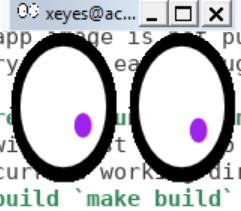

#  xeyes
This is a proof of concept for X11 forwarding from the container to the docker engine host. 

It should be a good starting point for a lab playing with changing the Dockerfile, and installing and launching other X11 apps such as xclock etc.

See the supporting [Dockerfile](Dockerfile) and the  [Makefile](Makefile)
## TL;DR
### To run this app
1. install docker https://docs.docker.com/install/ 
    * on *nix you will need to add your user to the docker group to run as a regular user `sudo usermod -aG docker youruserid`
2. clone this repo, cd into this directory, run `make build` then `make run` 

**__Note__** If you are newly learning docker I __strongly__ suggest you use the command line interface as it may be used anywhere: windoze, *nix, and cloud shells.  No need to learn new interfaces every time.

## docker registry image repo
The app image is not pushed to my re
gistry, it's easy enough to just build it.

## create & run the container image
You will first have to clone this repo and cd into this directory, the build assumes the Dockerfile is in the current working directory.
### build `make build`
```
tricia@acerubuntu1804:~/ecq/docker-ecq2020/xeyes$ make build
docker build -t tricia/xeyes .
Sending build context to Docker daemon  9.728kB
Step 1/4 : FROM alpine:latest
 ---> e7d92cdc71fe
Step 2/4 : LABEL maintainer="P Campbell" email="pcampbell.edu@gmail.com" modified="2020-04-02"
 ---> Using cache
 ---> 7b0cac2c0a35
Step 3/4 : RUN apk add --no-cache xeyes
 ---> Using cache
 ---> df0f538af447
Step 4/4 : ENTRYPOINT [ "/usr/bin/xeyes", "-fg", "purple" ]
 ---> Using cache
 ---> 7990a35320bf
Successfully built 7990a35320bf
Successfully tagged tricia/xeyes:latest
```
### running the container `make run`
The terminal is in the controll of the containerized app, when you close the eyes, the container ends.
```
tricia@acerubuntu1804:~/ecq/docker-ecq2020/xeyes$ make run
docker run --net=host --rm -e DISPLAY=localhost:11.0 -v ~/.Xauthority:/root/.Xauthority --name xeyes  tricia/xeyes
```

### docker commands
see  [common docker commands](../docker-usage-overview/DOCKERCMDS.md) 
### docker-compose commands
see  [common docker commands](../docker-usage-overview/DOCKERCOMPOSECMDS.md)


